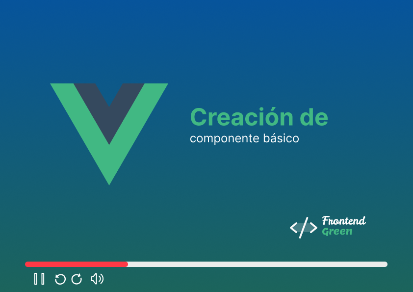

# Componente básico

Creación de componente básico en Vue

## Configuración IDE recomendada

[VSCode](https://code.visualstudio.com/) + [Vue VSCode Snippets](https://marketplace.visualstudio.com/items?itemName=sdras.vue-vscode-snippets).


## Configuración del proyecto

```sh
npm install
```

### Compilar y levanta app en desarrollo

```sh
npm run dev
```

### Compilar y minificar para PRODUCCIÓN

```sh
npm run build
```

### Youtube
[](https://www.youtube.com/watch?v=Y6USNH76d-o)